# GHCP Usage Dashboard — Architecture Diagram

```mermaid
graph TB
    %% ── External: GitHub APIs ─────────────────────────────────────────
    subgraph GitHub["GitHub APIs"]
        direction TB
        GH_ENT["Copilot Metrics API<br/>(enterprise-1-day)"]
        GH_ORG["Copilot Metrics API<br/>(org-1-day, users-1-day)"]
        GH_SEATS["Seats API<br/>(org billing/seats)"]
        GH_TEAMS["Teams API<br/>(org/teams, enterprise/teams)"]
        GH_GHAS["GHAS APIs<br/>(code-scanning, dependabot,<br/>secret-scanning)"]
        GH_BILLING["Billing API<br/>(metered usage, premium requests)"]
    end

    %% ── Auth ──────────────────────────────────────────────────────────
    subgraph Auth["Authentication (src/lib/github/)"]
        PAT["PAT Token<br/>GITHUB_TOKEN"]
        APP["GitHub App JWT<br/>GITHUB_APP_ID / KEY / INSTALLATION_ID"]
        AUTH_RESOLVE["Auth Resolution<br/>(api-base.ts)<br/>Enterprise → PAT<br/>Org → App (if configured)"]
    end

    PAT --> AUTH_RESOLVE
    APP --> AUTH_RESOLVE

    %% ── GitHub Clients ────────────────────────────────────────────────
    subgraph Clients["GitHub API Clients (src/lib/github/)"]
        MC["metrics-client.ts"]
        SC["seats-client.ts"]
        TC["teams-client.ts"]
        CC["code-scanning-client.ts"]
        DC["dependabot-client.ts"]
        SEC["secret-scanning-client.ts"]
        BC["billing-client.ts"]
    end

    AUTH_RESOLVE --> MC & SC & TC & CC & DC & SEC & BC
    MC --> GH_ENT & GH_ORG
    SC --> GH_SEATS
    TC --> GH_TEAMS
    CC --> GH_GHAS
    DC --> GH_GHAS
    SEC --> GH_GHAS
    BC --> GH_BILLING

    %% ── Sync Services ─────────────────────────────────────────────────
    subgraph SyncLayer["Sync Services (src/lib/db/)"]
        direction TB
        SS["sync-service.ts<br/>fullSync / backfill / incremental<br/>loops over all configured enterprises"]
        GS["ghas-sync-service.ts<br/>fullGhasSync / incremental<br/>code-scanning, dependabot, secret-scanning"]
        BIS["billing-sync-service.ts<br/>syncBilling"]
        SCHED["auto-sync-scheduler.ts<br/>(cron-based background sync)"]
    end

    MC --> SS
    SC --> SS
    TC --> SS
    CC --> GS
    DC --> GS
    SEC --> GS
    BC --> BIS
    SCHED -->|triggers| SS & GS

    %% ── Database Layer ────────────────────────────────────────────────
    subgraph DB["Database Layer (src/lib/db/)"]
        direction TB
        SQLITE[("SQLite<br/>data/copilot-metrics.db<br/>WAL mode")]

        subgraph Tables["Core Tables"]
            T1["enterprise_daily_metrics"]
            T2["org_daily_metrics"]
            T3["user_daily_metrics"]
            T4["seats"]
            T5["teams / team_members"]
            T6["ghas_code_scanning_alerts"]
            T7["ghas_dependabot_alerts"]
            T8["ghas_secret_scanning_alerts"]
            T9["billing_metered_usage<br/>billing_premium_requests"]
        end

        subgraph SummaryTables["Pre-Aggregated Summary Tables"]
            ST1["daily_aggregate_cache"]
            ST2["user_period_summary"]
            ST3["team_summary_cache"]
        end

        REPO["metrics-repo.ts / seats-repo.ts<br/>teams-repo.ts / ghas-repo.ts<br/>billing-repo.ts"]
        SUMM["summary-tables.ts<br/>refreshAllSummaries()<br/>(called after every sync)"]
        GETDB["getDb() singleton<br/>database.ts"]
    end

    SS --> REPO
    GS --> REPO
    BIS --> REPO
    REPO --> GETDB
    GETDB --> SQLITE
    SQLITE --- Tables
    SUMM --> SummaryTables
    SS -->|after sync| SUMM

    %% ── Config ────────────────────────────────────────────────────────
    subgraph Config["Configuration (src/lib/config/)"]
        ECFG["enterprise-config.ts<br/>getConfiguredEnterprises()<br/>getResolvedOrgsForEnterprise()"]
        DCFG["dashboard-config.ts<br/>dashboard-config.json<br/>feature toggles"]
    end

    SS --> ECFG & DCFG
    GS --> DCFG

    %% ── In-Memory Cache ───────────────────────────────────────────────
    subgraph CacheLayer["In-Memory Cache (src/lib/cache/)"]
        CACHE["memory-cache.ts<br/>LRU + TTL (2–30 min)<br/>invalidateAll() after sync"]
    end

    SS -->|invalidateAll| CACHE

    %% ── API Routes ────────────────────────────────────────────────────
    subgraph APIRoutes["API Routes (src/app/api/)"]
        direction LR
        R_METRICS["/api/metrics<br/>code-gen, features,<br/>models, ide-langs"]
        R_USERS["/api/users<br/>server-side paginated"]
        R_TEAMS["/api/teams"]
        R_SEATS["/api/seats"]
        R_SECURITY["/api/security"]
        R_BILLING["/api/billing, billing-usage<br/>billing-premium"]
        R_SYNC["/api/sync<br/>POST: start sync<br/>GET: status + progress"]
        R_FILTERS["/api/filters<br/>teams, orgs, enterprises"]
    end

    CACHE --> R_METRICS & R_USERS & R_TEAMS & R_SEATS & R_SECURITY & R_BILLING & R_FILTERS
    GETDB --> R_METRICS & R_USERS & R_TEAMS & R_SEATS & R_SECURITY & R_BILLING & R_FILTERS
    R_SYNC -->|triggers| SS & GS

    %% ── Scope Filtering ───────────────────────────────────────────────
    subgraph Filters["Scope Filtering (src/lib/api/)"]
        SF["parseScopeFilter()<br/>filterByScope()<br/>buildLoginFilter()<br/>buildEnterpriseFilter()"]
    end

    R_METRICS & R_USERS & R_TEAMS --> SF

    %% ── Aggregation ───────────────────────────────────────────────────
    subgraph Agg["Aggregation (src/lib/aggregation/)"]
        AGG["aggregation-queries.ts<br/>json_each() SQL aggregation<br/>completion vs agent metrics"]
    end

    GETDB --> AGG
    AGG --> R_METRICS

    %% ── Frontend ──────────────────────────────────────────────────────
    subgraph Frontend["Frontend (src/app/dashboard/ + src/components/)"]
        direction TB
        subgraph Pages["Dashboard Pages"]
            P1["Overview / Code Generation"]
            P2["Users / Teams / Seats"]
            P3["Models / IDE & Languages"]
            P4["Security (GHAS)"]
            P5["Billing / Usage / Premium"]
            P6["CLI / Pull Requests / Chat Modes"]
        end

        subgraph UIComponents["UI Components (src/components/)"]
            CHARTS["Recharts Charts<br/>(30+ chart components)"]
            CARDS["Metric Cards"]
            FILTER_UI["Scope Filter UI<br/>(teams, orgs, enterprises)"]
            TABLES["Sortable / Paginated Tables"]
        end

        subgraph State["Client State"]
            RQ["@tanstack/react-query<br/>(data fetching + caching)"]
            CTX["ScopeContext / DateRangeContext"]
        end

        subgraph Export["Export (src/lib/export/)"]
            PDF["PDF (jspdf + html2canvas)"]
            CSV["CSV generator"]
        end
    end

    R_METRICS & R_USERS & R_TEAMS & R_SEATS & R_SECURITY & R_BILLING & R_FILTERS -->|JSON responses| RQ
    RQ --> Pages
    CTX --> Pages
    Pages --> UIComponents
    Pages --> Export

    %% ── Styles ────────────────────────────────────────────────────────
    classDef github fill:#24292e,color:#fff,stroke:#444
    classDef auth fill:#1e3a5f,color:#fff,stroke:#2d6db5
    classDef sync fill:#1a4731,color:#fff,stroke:#2d8653
    classDef db fill:#3b2a1a,color:#fff,stroke:#b36b00
    classDef cache fill:#3b1a3b,color:#fff,stroke:#9b3b9b
    classDef api fill:#1a2e4a,color:#fff,stroke:#2d5fa3
    classDef frontend fill:#1a1a3b,color:#fff,stroke:#5353c6
    classDef config fill:#2e2e1a,color:#fff,stroke:#8c8c00

    class GH_ENT,GH_ORG,GH_SEATS,GH_TEAMS,GH_GHAS,GH_BILLING github
    class PAT,APP,AUTH_RESOLVE auth
    class SS,GS,BIS,SCHED sync
    class SQLITE,REPO,SUMM,GETDB,T1,T2,T3,T4,T5,T6,T7,T8,T9,ST1,ST2,ST3 db
    class CACHE cache
    class R_METRICS,R_USERS,R_TEAMS,R_SEATS,R_SECURITY,R_BILLING,R_SYNC,R_FILTERS,SF,AGG api
    class P1,P2,P3,P4,P5,P6,CHARTS,CARDS,FILTER_UI,TABLES,RQ,CTX,PDF,CSV frontend
    class ECFG,DCFG config
```

## Layer Summary

| Layer | Location | Purpose |
|---|---|---|
| **GitHub APIs** | External | Source of Copilot, GHAS, Billing, Teams, and Seats data |
| **Authentication** | `src/lib/github/` | PAT (enterprise endpoints) + GitHub App JWT (org endpoints) |
| **GitHub Clients** | `src/lib/github/` | Typed wrappers for every GitHub API endpoint |
| **Sync Services** | `src/lib/db/sync-*.ts` | Orchestrate day-by-day backfill and incremental syncs |
| **Database** | `src/lib/db/`, `data/*.db` | SQLite with WAL; raw tables + pre-aggregated summary tables |
| **In-Memory Cache** | `src/lib/cache/` | LRU + TTL cache wrapping all API route responses |
| **API Routes** | `src/app/api/` | Next.js route handlers; serve JSON with scope filtering & pagination |
| **Aggregation** | `src/lib/aggregation/` | SQL `json_each()` aggregation for feature/model/language breakdowns |
| **Configuration** | `src/lib/config/` | Enterprise list, org mapping, dashboard feature toggles |
| **Frontend** | `src/app/dashboard/`, `src/components/` | React pages + Recharts charts + TanStack Query client state |
| **Export** | `src/lib/export/` | PDF (jspdf) and CSV export from any paginated dataset |
